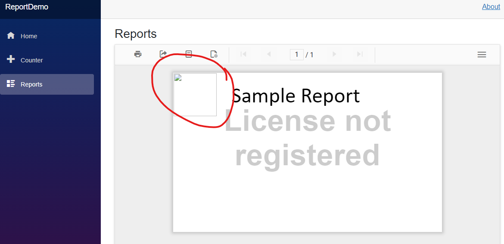
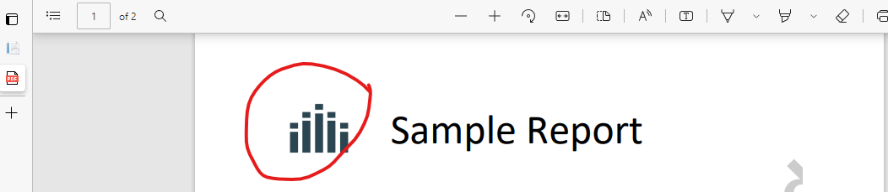

# Report Demo App
The image file from the sample report is not properly loading when running the app locally (I have not deployed it to test it on a server). The image is imbedded.

I have embedded the following image into my report:

Here is what happens when I run the application:

When I export the report to PDF, the image shows up:

